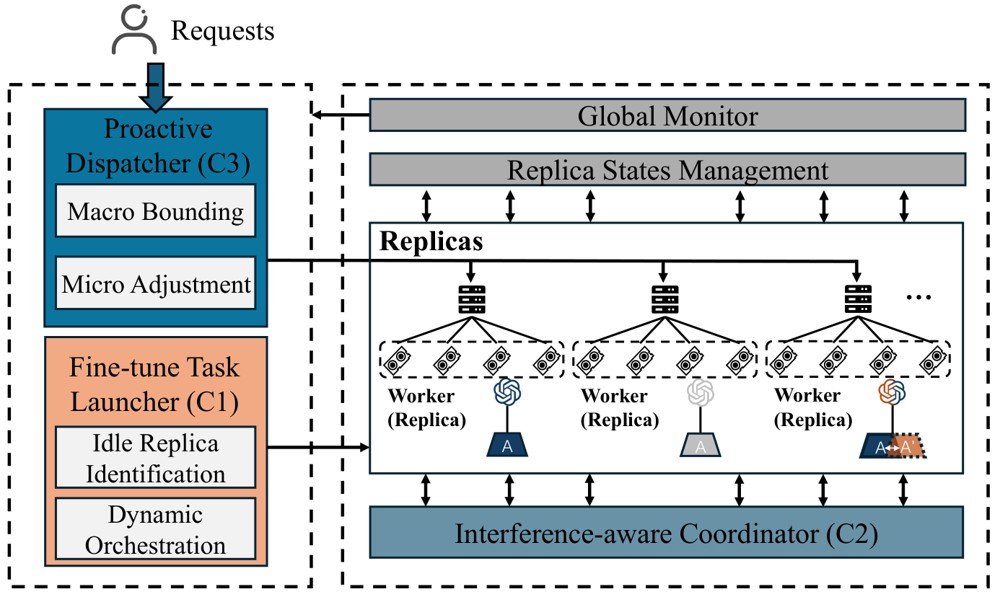
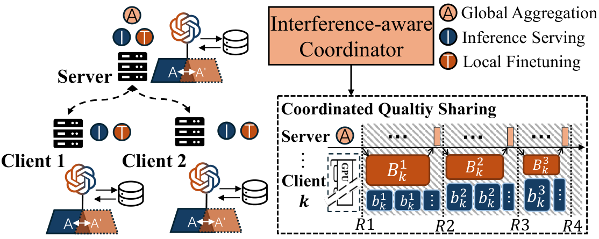

# CLIF

CLIF is a system for running PEFT fine-tuning alongside online LLM inference. It keeps inference replicas serving requests, detects when there is enough serving slack, and uses that slack to run federated adapter updates.

## What CLIF Provides

- A stateful replica pool with `SERVING`, `IDLE`, and `COMBINED` modes.
- A proactive dispatcher that routes requests and maintains inference batch bounds.
- A fine-tuning launcher that checks service pressure before admitting replicas into PEFT rounds.
- A coordinator that sets training and inference batch sizes for replicas running in `COMBINED`.
- A dual-adapter replica path that trains a shadow adapter while serving from the active adapter.
- Structured metrics for requests, serving batches, training rounds, replica states, and GPU usage.

## System Overview



At runtime, requests enter the dispatcher and are assigned to replicas. The launcher observes replica states and service pressure, then decides whether a new PEFT round can run. Replicas admitted to `COMBINED` continue serving while local adapter updates are executed.



The coordinator is used only for replicas in `COMBINED`. It uses recent runtime metrics to keep inference batch sizes within safe bounds while allocating a training batch size for local PEFT updates.

## Repository Layout

- `run.py`: CLI entry point.
- `main.py`: runtime assembly and metric export.
- `core/dispatcher.py`: CLIF request dispatcher.
- `core/fl_launcher.py`: PEFT round admission, execution, and aggregation.
- `core/coordinator.py`: combined-state batch-size coordinator.
- `core/replica.py`: replica and dual-adapter execution logic.
- `common/`: data loading, training utilities, state tracking, request generation, and monitoring.
- `scripts/run_smoke_fixed.sh`: small fixed-load smoke test.

## Installation

```bash
conda create -n clif python=3.12 -y
conda activate clif
pip install -r requirements.txt
```

Use a CUDA-enabled PyTorch build that matches your machine. Model access and GPU memory requirements depend on the model configured at runtime.

## Environment

CLIF is intended for GPU server and research-cluster environments rather than CPU-only execution. The public artifact assumes:

- NVIDIA GPUs with a CUDA-compatible PyTorch installation.
- Enough GPU memory to host one or more LLM replicas and LoRA adapters.
- Explicit multi-GPU mapping through `--replica_gpus`, for example `[[0],[1],[2],[3]]` for one replica per GPU or `[[0,1],[2,3]]` for model-parallel replicas.
- A shared filesystem or pre-synchronized model and dataset cache when running on multiple nodes.

## Quick Smoke Test

The smoke test is a lightweight wiring check for the public artifact. It uses a fixed request stream and a small public model setting. It is not intended to reproduce paper-scale experiments.

```bash
bash scripts/run_smoke_fixed.sh
```

Before running, adjust `MODEL_NAME` and `REPLICA_GPUS` if needed:

```bash
MODEL_NAME=meta-llama/Llama-3.2-1B REPLICA_GPUS='[[0],[1]]' bash scripts/run_smoke_fixed.sh
```

## Output Files

Runs write metrics under `output/`:

- `serve_metrics.xlsx`: served-batch latency, success, token, and quality metrics.
- `train_metrics.xlsx`: local PEFT round metrics.
- `train_step_metrics.xlsx`: per-update training metrics.
- `dispatch_metrics.xlsx`: dispatcher queueing and routing records.
- `request_gen_metrics.xlsx`: generated request records.
- `state_metrics.xlsx`: replica state transitions.
- `fl_round_metrics.xlsx`: federated round summaries.
- `gpu_monitor.xlsx`: GPU utilization and memory metrics when available.
- `summary.xlsx`: aggregate run summary.
